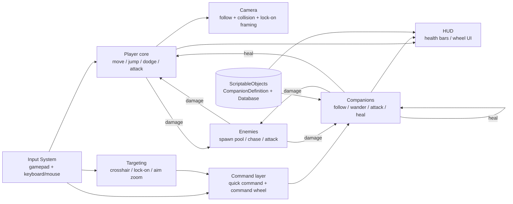
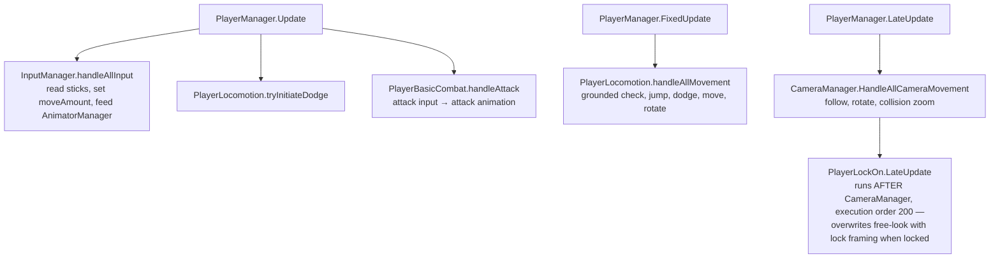
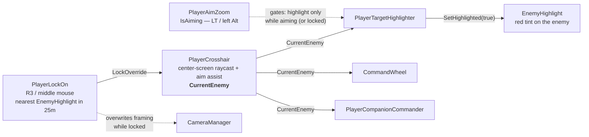
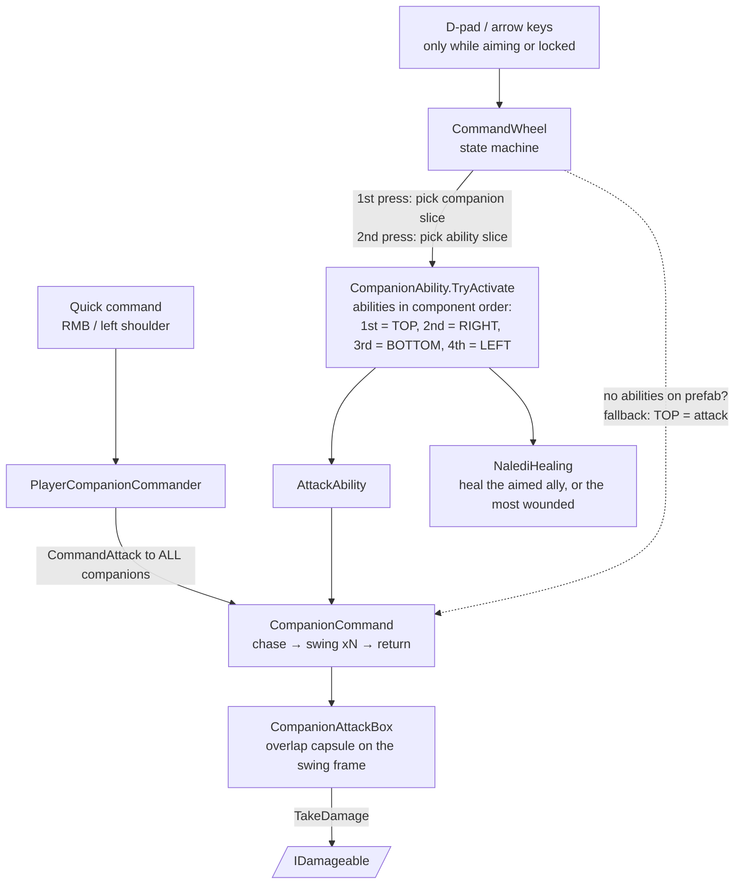
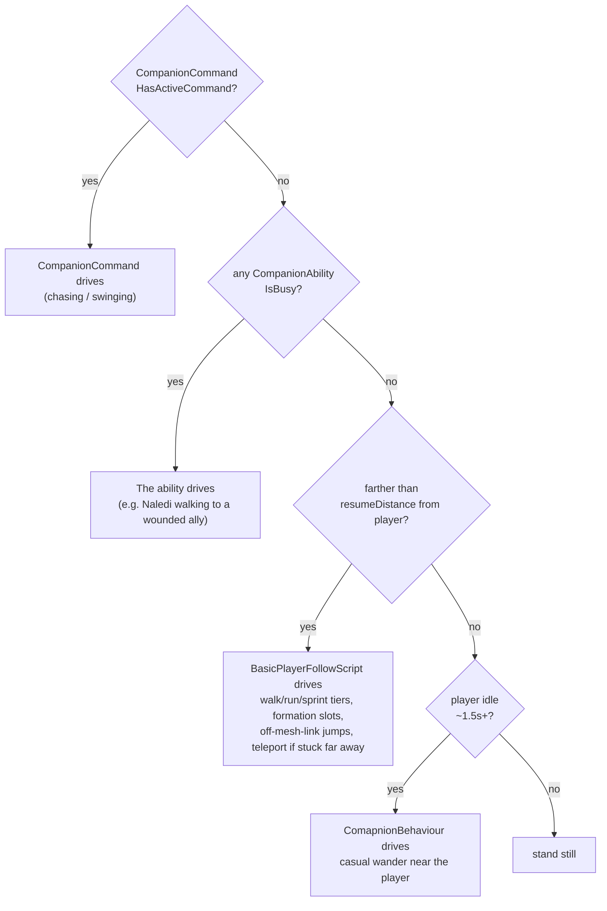
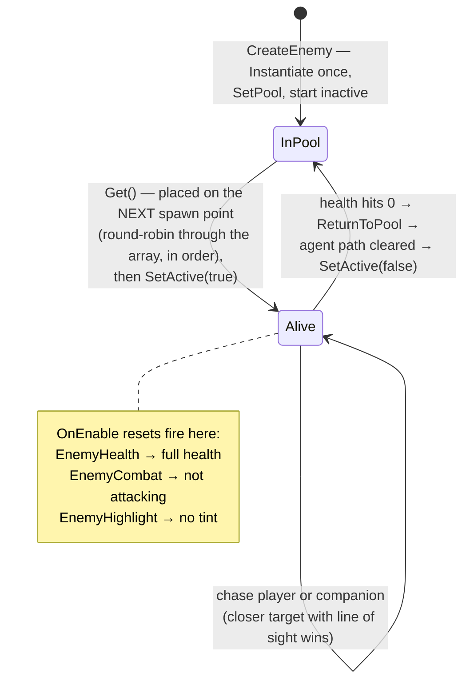
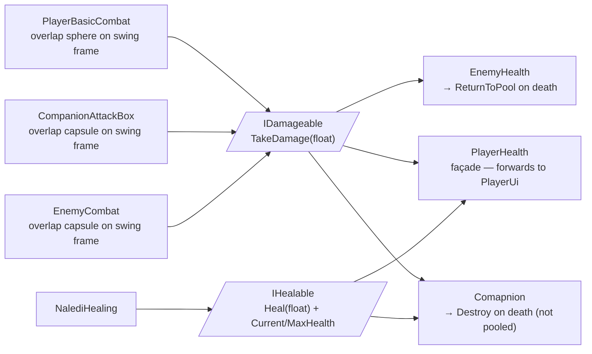

# EchoGame Code Map

How every script in the project connects, and the order to learn them in. Written for someone joining the project cold — read top to bottom, each section builds on the one before.

> A styled, shareable version of this doc lives at: https://claude.ai/code/artifact/48044653-c7d8-4e7a-b344-6db9bbdc9b26
> If a diagram disagrees with the code, the code wins — then fix the diagram.

**Reading order:**
1. [The big picture](#1-the-big-picture)
2. [A frame in the life of the player](#2-a-frame-in-the-life-of-the-player)
3. [The targeting pipeline](#3-the-targeting-pipeline--one-shared-current-enemy)
4. [Commanding companions](#4-commanding-companions)
5. [Who's driving the companion right now?](#5-whos-driving-the-companion-right-now)
6. [Enemies: the spawn pool and the chase](#6-enemies-the-spawn-pool-and-the-chase)
7. [Damage, healing, and the two interfaces](#7-damage-healing-and-the-two-interfaces)
8. [Health bars and the HUD](#8-health-bars-and-the-hud)
9. [How scripts find each other](#9-how-scripts-find-each-other)
10. [Gotchas](#10-gotchas--read-before-you-touch-anything)
11. [File map](#11-file-map)

---

## 1. The big picture

EchoGame is a third-person action game: a player, up to four AI companions who follow and fight alongside them, and enemies that spawn from a pool and hunt both. The code splits into five clusters. Everything combat-flavored meets in the middle at two tiny interfaces — `IDamageable` and `IHealable` — which is why the player, companions, and enemies can all hurt and heal each other without knowing each other's classes.

Two facts orient everything else:

- **The player is Rigidbody-driven; companions and enemies are NavMeshAgent-driven.** Companions and enemies deliberately set their Rigidbodies to kinematic so physics can't fight the agent for control of position (each script has a comment explaining this — don't "fix" it).
- **Attacks land via animation events, not code timers.** Every attack animation clip calls `DealDamage()` at the swing frame and `EndAttack()` near the end. If those events are missing from a clip, safety-net timeouts stop the character freezing, but no damage happens. When "attacks look broken", check the clip's events first.

## 2. A frame in the life of the player

`PlayerManager` (in `Assets/PlayerMovement/`) is the conductor. It's the only script with a real game loop — everything else it calls is a subordinate that does nothing on its own.

The pieces:

- `InputManager` — binds movement/camera/jump/dodge/attack through the generated `PlayerControls` asset and exposes them as public fields others poll. Note: *newer* scripts (lock-on, aim, wheel, commander) bind their own `InputAction`s in code instead, specifically to avoid regenerating that asset.
- `PlayerLocomotion` — Rigidbody velocity movement with walk/run/sprint tiers, jump with a grounded grace period, dodge with a roll direction. Freezes movement while `PlayerBasicCombat.isAttacking`.
- `PlayerBasicCombat` — fires the attack animation; the clip's `DealDamage` event does an overlap sphere and calls `IDamageable.TakeDamage` on whatever it catches.
- `AnimatorManager` — thin wrapper over the player's Animator (snapped locomotion values, jump/roll/attack triggers).
- `CameraManager` — follows the player, rotates from camera input, spherecasts so walls push the camera in.

## 3. The targeting pipeline — one shared "current enemy"

This is the most load-bearing design decision in the project: **`PlayerCrosshair.CurrentEnemy` is the single source of truth for "what is the player aiming at"**. Lock-on doesn't have its own target pipe — it force-feeds the crosshair through `LockOverride`. Everything downstream (highlight, command wheel, quick command) reads the crosshair, so free-aim and lock-on behave identically everywhere.

- `PlayerCrosshair` raycasts from screen center, with a forgiving spherecast fallback that picks the enemy visually nearest the reticle. Publishes `IsOverEnemy` / `CurrentEnemy`, and tints/scales the reticle.
- `PlayerLockOn` grabs the nearest `EnemyHighlight` within range, frames the camera on it every `LateUpdate`, and drops the lock if the target goes inactive (that's how pooled enemy deaths release locks cleanly) or drifts past break range.
- `PlayerTargetHighlighter` turns the crosshair target into the red glow, but only while aiming or locked. It walks up from the hit collider with `GetComponentInParent` because the ray often lands on a child collider.

## 4. Commanding companions

There are two ways to order companions around, both feeding the same entry point — `CompanionCommand.CommandAttack(target)`:

- **Quick command** (`PlayerCompanionCommander`) is the blunt tool: every companion in the scene charges the enemy under the reticle.
- **The wheel** (`CommandWheel`) is the precise tool: first d-pad press picks a companion (each of the four serialized slots is a slice), second press picks one of that companion's abilities. Slices show portraits from `CompanionDefinition.portrait` and ability icons in component order — *the order of ability components on the prefab is the wheel layout*.
- `CompanionCommand` owns the actual attack run: chase at `chaseSpeed`, stop in range, swing on cooldown, `attacksPerCommand` swings per order, then return to follow. Damage goes through `CompanionAttackBox` if present (real hit volume, can miss or multi-hit), else directly to the commanded target.
- `NalediHealing` also self-activates: it scans every few seconds for allies below 70% health and goes to heal them without being asked. A wheel command just forces the same machinery at any health level. It finds heal targets through `IHealable` — companions and the player alike.

## 5. Who's driving the companion right now?

Four scripts on one companion prefab all want to steer the same NavMeshAgent. There is no central brain — instead there's a **pecking order by polite yielding**: each lower-priority script checks the ones above it every frame and backs off. If you add a new behavior script, it must check everything above itself, or two scripts will fight over `SetDestination` and the companion will stutter.

- `BasicPlayerFollowScript` (note: lives in `Assets/Companion/`, not `Assets/Scripts/`) is the richest of the four: formation slots 0–3 so companions hold different positions behind the player, per-instance speed jitter so they don't march in lockstep, a jump coroutine for off-mesh links, and a teleport fallback when the path is blocked and the player is far away.
- `Comapnion` (yes, that spelling — see [gotchas](#10-gotchas--read-before-you-touch-anything)) is the body: identity from a `CompanionDefinition` asset, health (`IDamageable` + `IHealable`), the HUD slot claim, and the "player bumps into me and I step aside" push response.

## 6. Enemies: the spawn pool and the chase

Enemies are **pooled, not instantiated per spawn**. `Spawner` owns an `ObjectPool<EnemyFollowPlayer>`; death deactivates an enemy back into the pool instead of destroying it, and the next spawn reuses that same GameObject. Two consequences ripple through the whole codebase:

- "Is this enemy dead?" is asked as `activeInHierarchy`, never `== null`. Lock-on, the crosshair, companion commands, and Naledi all already do this.
- Every component on the enemy prefab resets its own per-life state in `OnEnable`, because `Awake`/`Start` only run on the first life. Health refills, combat clears a mid-swing state, the highlight clears its red tint.

The spawn cadence in `Spawner.Update`: every `timeBetweenSpawning` seconds, if any spawn points are wired and `CountActive` is under `maxActiveEnemies`, take one from the pool. The pool's `maxSize` only caps how many *dead* enemies are kept in reserve — `maxActiveEnemies` is the thing that limits the crowd.

The chase itself (`EnemyFollowPlayer`): pick between the player (tag `Player`) and the nearest companion (tag `Comapnion`) — line of sight beats no line of sight, then closer wins. Movement is NavMeshAgent with manual rotation so the enemy faces its target rather than its path. `EnemyCombat` swings when a target is inside its hit capsule, and freezes the chase mid-swing so the hitbox lands where committed.

## 7. Damage, healing, and the two interfaces

All combat converges on two interfaces in `Assets/Scripts/`. Attackers never know what they hit; they just call `TakeDamage` on whatever implements `IDamageable`. This is why adding a new damageable thing (a crate, a boss) requires zero changes to any attacker.

Death differs by faction, on purpose: enemies *release to the pool*, companions *Destroy* (and free their HUD bar in `OnDestroy`), and the player currently just bottoms out at 0 — there's no death handling yet.

## 8. Health bars and the HUD

`HealthBarUi` is the one generic bar widget (slider + "72 / 100" label + name). Everything health-shaped reuses it:

- **Player:** `PlayerUi` actually owns the player's health numbers — `PlayerHealth` is just the `IDamageable`/`IHealable` face that forwards to it. If you're looking for where player HP lives, it's `PlayerUi`.
- **Companions:** `CompanionHealthHud` is a singleton with four bar slots. Each `Comapnion` claims a slot on `Start`; the slot index comes from the companion's position in the `CompanionDatabase` asset, so **HUD order always matches database order**, not load order.
- **Enemies:** each enemy prefab carries its own little world-space canvas; `EnemyUI` just billboards it at the camera and `EnemyHealth` drives the slider.

## 9. How scripts find each other

Seven wiring mechanisms are in play. Knowing which one connects two scripts tells you where a broken link can hide (Inspector? scene? tag? animation clip?).

| Mechanism | Used for | Examples |
|---|---|---|
| Serialized Inspector refs | UI wiring, deliberate scene links | `CommandWheel`'s four companion slots, `PlayerHealth → PlayerUi`, spawner's prefab + points |
| `GetComponent` on the same GameObject | Sibling scripts on one prefab | everything on the player root; everything on a companion; everything on an enemy |
| `FindObjectOfType` / `FindWithTag` at startup | Cross-object glue with auto-find fallbacks | companions finding the player, wheel finding crosshair/aim/lock |
| Tags | Combat filtering and target acquisition | `Player`, `Comapnion`, `Enemy` |
| Interfaces | Decoupling attackers from victims | `IDamageable`, `IHealable` |
| Animation events | Hit timing | `DealDamage` / `EndAttack` on player, companion, and enemy attack clips |
| Singleton + ScriptableObjects | One-of-a-kind services and shared data | `CompanionHealthHud.Instance`; `CompanionDefinition` / `CompanionDatabase` assets |

## 10. Gotchas — read before you touch anything

- **The "Comapnion" typo is load-bearing.** The class `Comapnion`, the file, *and the Unity tag* `"Comapnion"` all share the misspelling, and enemy targeting looks companions up by that tag string. Renaming any one of them without the others silently breaks enemy target acquisition. Fix all-or-nothing, or leave it.
- **Enemies never Destroy.** They deactivate into the pool. Any new system that tracks enemies must treat `activeInHierarchy == false` as dead, and any new per-life state on the enemy prefab needs an `OnEnable` reset.
- **Ability component order is UI layout.** Reordering `CompanionAbility` components on a companion prefab reorders that companion's wheel slices. First component = TOP slice, by convention Attack.
- **Player health lives in `PlayerUi`**, not `PlayerHealth`. The latter is a forwarding façade.
- **Two input styles coexist.** Core movement goes through the generated `PlayerControls` asset; newer scripts bind `InputAction`s in code precisely so they don't force a regen of that asset. Follow the in-code style for new bindings.
- **Kinematic Rigidbodies on agents are intentional.** Dynamic bodies fight NavMeshAgents. Both enemies and companions rely on this — the comments in `EnemyFollowPlayer.Awake` and `Comapnion.Awake` explain it.
- **Three files are empty template stubs:** `EnemySpawning.cs`, `EnemyPatrolling.cs`, and `SriptableCompanions.cs`. They do nothing; don't go looking for their callers.

## 11. File map

| Folder | What lives there |
|---|---|
| `Assets/PlayerMovement/` | The player core: `PlayerManager`, `InputManager`, `PlayerLocomotion`, `PlayerControls` (generated), `PlayerCombat/PlayerBasicCombat` |
| `Assets/Scripts/PlayerScripts/` | Targeting + player-side systems: crosshair, lock-on, aim zoom, target highlighter, companion commander, `PlayerHealth`, `PlayerUi`, `HealthBarUi` |
| `Assets/Scripts/CameraScripts/`, `…/AnimationScripts/` | `CameraManager`, `AnimatorManager` |
| `Assets/Scripts/CompanionScripts/` | Companion brain + body: `Comapnion`, `ComapnionBehaviour`, `CompanionCommand`, `CompanionAttackBox`, `CompanionAbility` + `AttackAbility` + `NalediHealing`, `CompanionHealthHud` |
| `Assets/Companion/` | `BasicPlayerFollowScript` and `ScriptableCompanions/`: `CompanionDefinition`, `CompanionDatabase` |
| `Assets/Scripts/Enemy Scripts/` | Everything enemy: `EnemyHealth`, `EnemyHighlight`, `EnemyFollowPlayer`, `EnemyCombat`, `EnemyUI`, `EnemySpawning/Spawner` |
| `Assets/Scripts/UiCommandSystem/` | `CommandWheel` |
| `Assets/Scripts/` (root) | The interfaces: `IDamageable`, `IHealable` |
| `Assets/EenemyPrefabs/` | `Enemytest.prefab` — the pooled enemy |

---

*Generated from a full read of the codebase on the `EnemySpawning` branch, July 2026.*
